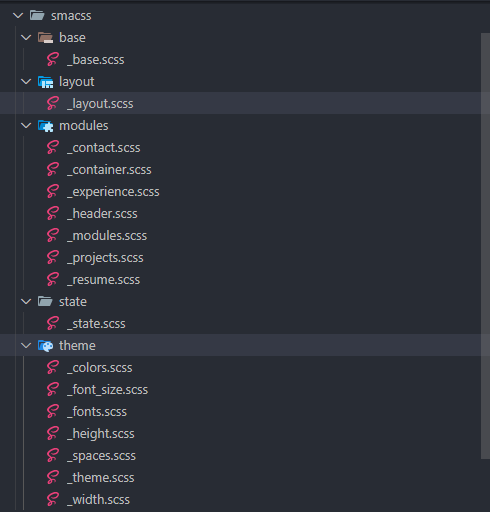

# README
En esta parte se detallarán la arquitectura sass, los elementos creados y el tipo de diseño responsive que se utilizó.

## 1- Arquitectura SASS

### A. Nomenclatura
Para este proyecto se utilizó la arquitectura SUITCSS que inicia con el bloque en Pascal case y usa como separador el - entre el elemento y -- con el modifier

---

.MyComponent {...} 

.MyComponent-element {...}

.MyComponent--modifier {...}

---

ejemplo: 

---

.Menu {...}

.Menu-item {...}

.Menu-link {...}

.Menu--isLiked {...}

---

En el proyecto podemos apreciarlo en el siguiente componente con el html

```HTML
    <header class="Navigation">
        <nav class="Navigation-list">
            <a class="Navigation-item  Navigation-item--isActive" href="#resumen">Resumen</a>
            <a class="Navigation-item" href="#aboutme">Sobre mí</a>
            <a class="Navigation-item" href="#experiencia">Experiencia</a>
            <a class="Navigation-item" href="#proyectos">Proyectos</a>
            <a class="Navigation-item" href="contacto/contacto.html" target="_blank">Contactar</a>
        </nav>
    </header>
```

y su css en sass se encuentra en el archivo  con ruta ./smacss/modules/_header_.scss
```CSS
.Navigation {
    padding: $space-base;
    margin-block: 20px;
    &-list{
        display: flex;
        justify-content: space-evenly;
        align-items: center;
        flex-wrap: wrap;
        gap: $space-2;
    }
    &-item{
        text-decoration: none;
        color: $color-white;
        font-weight: bold;
        font-size: $font_medium;
        &--isActive{
            color: $color-yellow;
        }
    }
}
```

### B. Arquitectura
#SMACSS

Arquitectura en la organizamos los estilos y componentes por carpetas

1. base: Para estilos generales
2. layout: Para regiones, secciones area de la página.
3. Modules: estructura para los componentes.
4. state: para los estados de los componentes.
5. theme: almacena las variables de colores, tipografías y tamaños.



## 2- Elementos creados

### 1. Principal Layout

```CSS
principal-layout {
    padding: $space-2;
}
```

### 2. Contact Layout

```CSS
contact-layout {
    padding: $space-3;
}
```

### 3. Contact Layout

```CSS
contact-layout {
    padding: $space-3;
}
```

### 4. Contact

```CSS
.Contact{
    margin-block: $space-base;
    &-article{
        display: flex;
        justify-content: center;
        align-items: center;
        flex-wrap: wrap;
        gap: $space-3;
    }
    &-form{
        display: flex;
        flex-direction: column;
        max-width: $width-60;
        gap: $space-base;
        &-label{
            flex: 1;
        }
        &-input{
            flex: 1;
        }
    }
    &-figure{
        &-image{
            width: $width-20;
            height: $height-20;
            border: $width-base solid $color-red;
            &:hover {
                transform: rotate(23deg);
            }
        }
    }
}
```

### 5. Principal container

```CSS
.PrincipalContainer {
    margin-block: $width-3;
    &-title{
        font-size: $font_large;
    }
}
```

### 6. Container input

```CSS
.containerInput {
    display: flex;
    gap: $space-base;
    flex-wrap: wrap;
}
```

### 7. Experience

```CSS
.Experience {
    &-container {
        display: grid;
        grid-template-columns: repeat(auto-fit, minmax($width-25, 1fr));
        gap: $space-3;
        margin-block: $space-base;
        position: relative; 
    }
    &-article {
        display: flex;
        flex-direction: column;
        align-items: center;
        justify-content: center;
        background-color: $color-black;
        padding-inline: $space-base;
        padding-block: $space-2;
        border-radius: $width-base;
        box-shadow: 0px 0px $width-base $color-shadow;
        transition: transform 0.3s ease, z-index 0.3s ease;
        gap: $space-base;
        z-index: 1;
        &-date{
            font-size: $font_medium;
        }
        &-job{
            font-size: $font_medium;
            margin-block: $space-base;
            color: $color-yellow;
            font-weight: bold;
        }
        &:hover {
            transform: scale(1.2);
            z-index: 10;
            backdrop-filter: blur(100px)
        }
    }
}
```

### 8. Header

```CSS
.Navigation {
    padding: $space-base;
    position: sticky;
    z-index: 200;
    top: 0;
    backdrop-filter: blur(10px);
    &-list{
        display: flex;
        justify-content: space-evenly;
        align-items: center;
        flex-wrap: wrap;
        gap: $space-2;
    }
    &-item{
        text-decoration: none;
        color: $color-white;
        font-weight: bold;
        font-size: $font_medium;
        &--isActive{
            color: $color-yellow;
        }
    }
}
```

### 9. Projects

```CSS
.Projects{
    &-article{
        display: flex;
        flex-direction: row;
        gap: $space-2;
        flex-wrap: wrap;
        margin-block: $space-base;
        &-description{
            flex: 1;
            gap: $space-2;
            display: flex;
            flex-direction: column;
            @media (max-width: 420px) {
               min-width: $width-40;
            }
        }
        &-title{
            font-size: $font_medium;
            color: $color-yellow;
            font-weight: bold;
        }
    }
    &-figures{
        flex: 1;
        display: grid;
        grid-template-columns: repeat(auto-fit, minmax($width-10, 1fr));
        gap: $space-base;
        margin-block: $space-base;
        position: relative;
        &-foto{
            max-width: $width-12;
            box-shadow: $width-zero $width-zero $width-base $color-gray-black;
            transition: transform 0.3s ease, z-index 0.3s ease;
            z-index: 1;
            &:hover {
                transform: scale(2);
                z-index: 10;
                backdrop-filter: blur(100px)
            }
        }
    }

    @media (max-width: 1040px) {
        &-figures {
            gap: $space-3;
        }
    }
}
```

### 10. Resume

```CSS
@keyframes colorshadow {
    from{box-shadow: $width-zero $width-zero $width-base $color-gray-black;}
    to{box-shadow: $width-zero $width-zero $width-2 $color-red;}
}

.Resume{
    display: flex;
    justify-content: space-between;
    align-items:center;
    gap: 30px;
    flex-wrap: wrap;
    &-figure{
        &-foto{
            width: $width-10;
            height: $height-10;
            border-radius: $width-base;
            box-shadow: $width-zero $width-zero $width-base $color-gray-black;
            &:hover{
                animation-name: colorshadow;
                animation-duration: 1s;
                animation-iteration-count: infinite;
            }
        }
    };
    &-article {
        flex: 2;
        .PresentationText{
            font-size: $font_large
        }
        .DescriptionText{
            font-size: $font_medium
        }
    }
};

```

## 3- Tipo de diseño responsive

Se utilizó first desktop y para ello se utilizó maxwidth como vemos en los siguientes ejemplos 

```CSS
.Projects{
    &-article{
        &-description{
            @media (max-width: 420px) {
               min-width: $width-40;
            }
        }
    }
    @media (max-width: 1040px) {
        &-figures {
            gap: $space-3;
        }
    }
}


```

